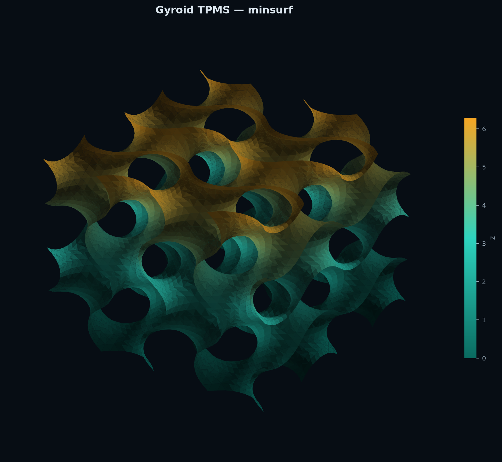
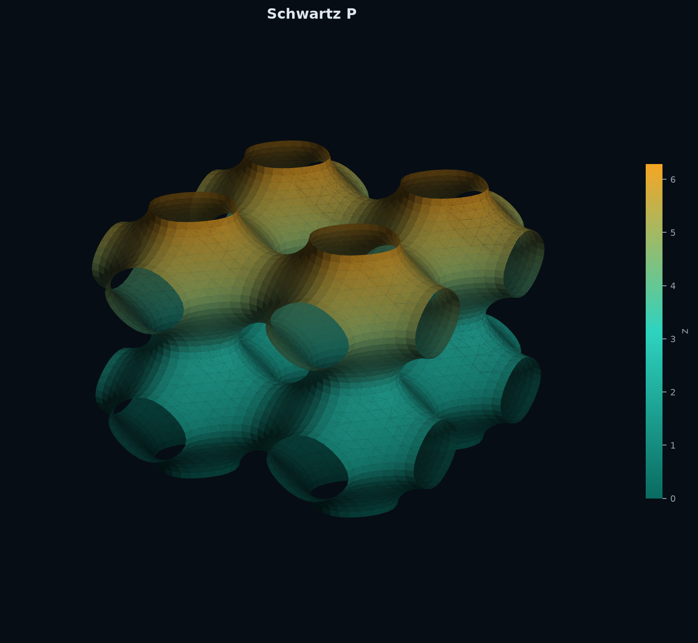
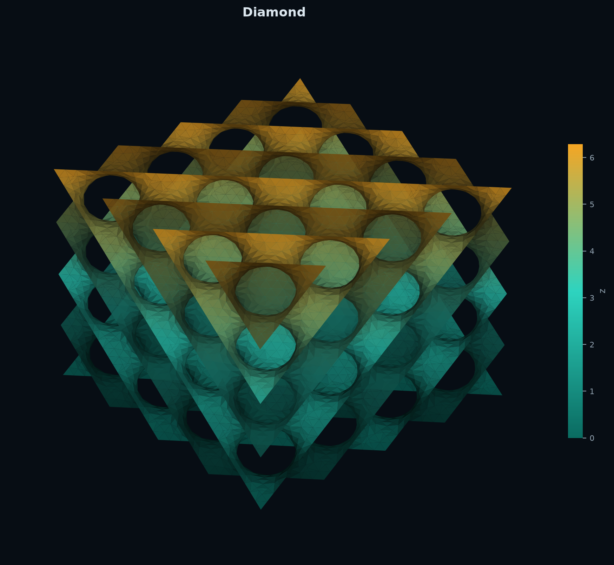
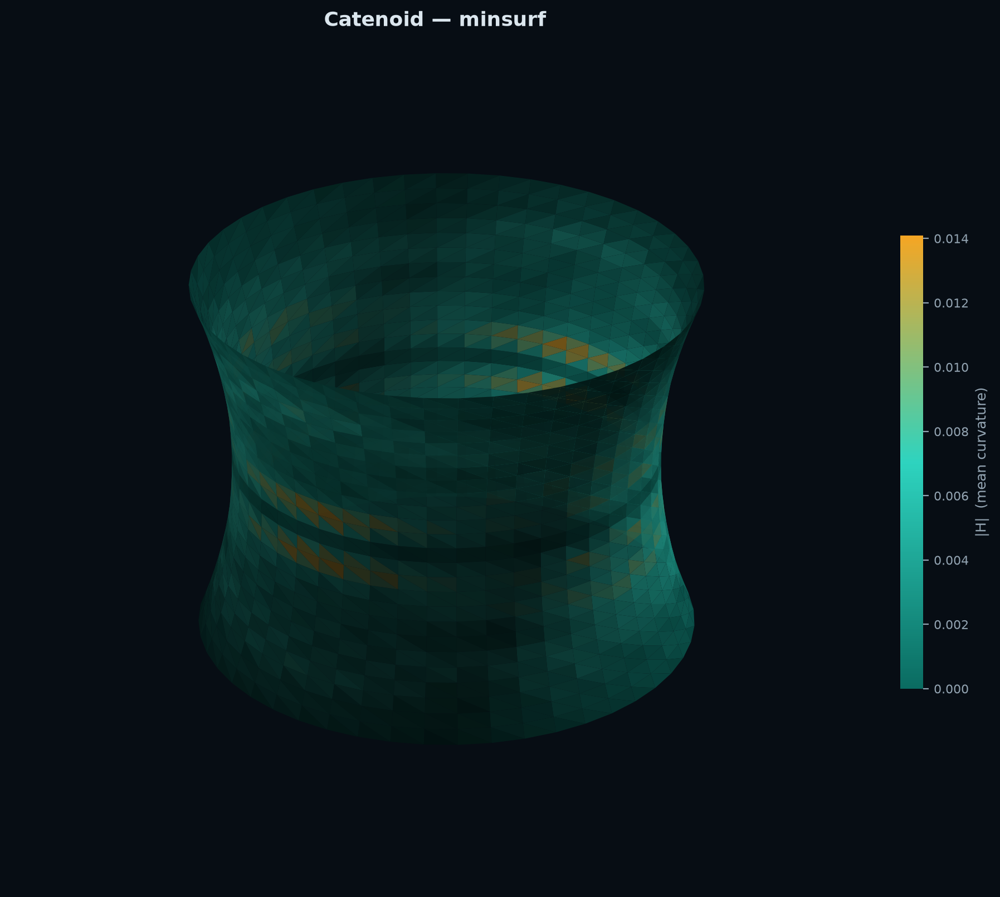
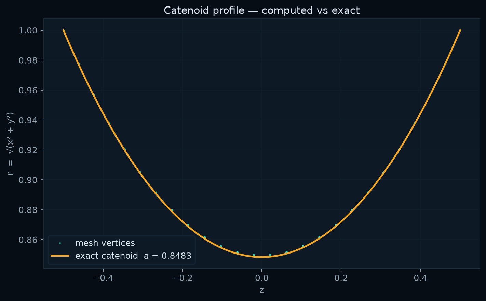

# minsurf


**Discrete minimal-surface toolkit** — soap-film form-finding, TPMS generator for 3-D printing, cotangent-Laplacian mean-curvature flow with exact-solution validation.

**Try it live — no install needed:**

| Demo | What it shows |
|---|---|
| [Soap-Film Solver](https://ryansanei.github.io/minsurf/soap_film_solver.html) | Pick a wire frame (saddle ring, wavy ring, two-ring catenoid) — watch the mesh flow to H=0 in real time; see the Goldschmidt collapse at ratio 1.3255 |
| [TPMS Explorer](https://ryansanei.github.io/minsurf/tpms_explorer.html) | GPU-raymarched Gyroid / Schwartz-P / Diamond / Neovius — drag to orbit, sliders for cells and level |
| [Tensile Form-Finding](https://ryansanei.github.io/minsurf/formfinding.html) | Click to place masts, press Solve, export OBJ |
| [Associate Family](https://ryansanei.github.io/minsurf/associate_family.html) | Drag the θ slider to morph catenoid ↔ helicoid |

**Install the Python library:**
```bash
pip install minsurf              # core solver
pip install "minsurf[tpms]"      # + TPMS / Gyroid generator
```

---

## Gallery

<table>
<tr>
<td align="center"><br><sub>Gyroid · coloured by height</sub></td>
<td align="center"><br><sub>Schwartz-P · teal-amber colourmap</sub></td>
<td align="center"><br><sub>Diamond · directional shading</sub></td>
</tr>
<tr>
<td align="center"><br><sub>Catenoid · coloured by |H|</sub></td>
<td align="center"><br><sub>Catenoid r(z) · solved vs exact</sub></td>
<td align="center" valign="middle"><a href="https://ryansan.github.io/minsurf/tpms_explorer.html"></a><br><br><a href="https://ryansan.github.io/minsurf/formfinding.html"></a></td>
</tr>
</table>

---

## Overview

`minsurf` computes **discrete minimal surfaces** (soap films): triangulated surfaces of zero mean curvature with a fixed boundary, found by relaxing a seed mesh under discrete mean-curvature flow.  
It is built on transparent discrete differential geometry (DDG) — every numerical claim is checkable against an exact closed-form solution.

---

## Motivation

The three use cases:

1. **TPMS for 3-D printing**: generate Gyroid, Schwartz-P, Diamond, Neovius infill as STL — the gold standard for equal-stiffness infill on FDM printers.
2. **Tensile/membrane form-finding** for architecture: supply a boundary curve, get the equilibrium membrane geometry.
3. **Teaching** differential geometry: every smooth concept (Laplace–Beltrami, mean curvature, Gauss–Bonnet) is implemented explicitly in ~50 lines of NumPy so students can read and modify it.

---

## Core Idea

```
boundary curve(s)
      ↓
  seed mesh          structured triangulation, boundary pinned
      ↓
mean-curvature flow  implicit: (M + τL) X^{n+1} = M X^n
      ↓
minimal surface      Lx = 0, max|H| → 0
      ↓
validate / export    compare vs exact, write OBJ/STL/PLY/HTML
```

---

## Mathematical Foundation

A surface is minimal if and only if its coordinate functions are harmonic:
$$\mathbf{H} = 0 \iff \Delta_S \mathbf{x} = 0 \iff \mathbf{L}\mathbf{x} = 0,$$
where $\mathbf{L}$ is the **cotangent Laplacian** with weights $w_{ij} = \frac{1}{2}(\cot\alpha_{ij} + \cot\beta_{ij})$.

The implicit mean-curvature flow
$$(\mathbf{M} + \tau \mathbf{L})\,\mathbf{x}^{n+1} = \mathbf{M}\,\mathbf{x}^n$$
(Desbrun et al. 1999) is unconditionally stable and converges to $\mathbf{L}\mathbf{x}^* = 0$.

See [docs/math_background.md](docs/math_background.md) for the full derivation including the first-variation argument, the cotangent-Laplacian = area-gradient identity, the worked catenoid $H=0$ computation, the Weierstrass–Enneper table, and the 1.3255 stability threshold.

---

## Features

- **TPMS generator** — Gyroid, Schwartz-P, Diamond, Neovius as watertight STL (`minsurf gyroid`)
- **Implicit semi-implicit flow** (SPD system, CG solver) — large steps, unconditional stability
- **Explicit forward-Euler flow** for comparison and diagnostics
- **Exact solutions**: catenoid, helicoid, Enneper surface, Scherk surface
- **Weierstrass–Enneper** representation with numerical integration
- **Associate family**: catenoid ↔ helicoid isometric deformation
- **Catenoid stability analysis**: 1.3255 threshold, Goldschmidt collapse detection, Jacobi operator
- **Gauss–Bonnet validation** and convergence study
- **OBJ, STL (binary), PLY** export (hand-written, no heavy geometry library)
- **Self-contained WebGL viewer** (`minsurf view`) — teal-amber dark-theme renders
- **JSON report** with all parameters and results
- Three **interactive HTML demos** (associate family, tensile form-finding, raymarched TPMS)
- Named **CLI presets** for common cases

---

## Installation

```bash
# With uv (recommended)
uv venv && uv pip install -e ".[dev,tpms]"

# Or with pip
python -m venv .venv && source .venv/bin/activate
pip install -e ".[dev,tpms]"

# Minimal install (no TPMS, no dev tools)
pip install minsurf
```

---

## Quick Start

```bash
# Generate a Gyroid infill for 3-D printing
minsurf gyroid --cells 3 --output gyroid/

# Solve the catenoid preset and validate against the exact solution
minsurf solve --preset catenoid

# Open the interactive WebGL viewer
minsurf view examples/output/catenoid/catenoid_viewer.html

# Run the curated demo set (writes to examples/output/demo/)
minsurf demo

# Study the stability threshold
minsurf solve --preset two-rings --separation 1.6 --output out/collapse

# Run the convergence study (writes docs/validation.md)
minsurf validate
```

---

## Solve a Custom Boundary

```python
import numpy as np
from minsurf import boundaries, flow, io, metrics

# Custom 3-D boundary polygon
theta = np.linspace(0, 2*np.pi, 60, endpoint=False)
pts = np.column_stack([np.cos(theta), np.sin(theta), 0.4*np.sin(3*theta)])

seed = boundaries.from_points(pts, n_radial=20)
mesh, hist = flow.solve(seed, method="implicit", tau=0.05, tol=1e-6)

print(f"Area: {mesh.total_area():.4f}")
print(f"max|H|: {metrics.max_mean_curvature(mesh):.2e}")
io.write_stl(mesh, "my_surface.stl")
```

---

## CLI Presets

| Preset | Boundary | Purpose |
|--------|----------|---------|
| `catenoid` | two-rings | Validate against exact catenoid; show neck |
| `two-rings` | two-rings | Stability study; collapse past ratio 1.3255 |
| `saddle-ring` | disk | Curved minimal surface from `z = A sin 2θ` |
| `wavy-ring` | disk | Monkey-saddle from `z = A sin 3θ` |
| `enneper` | analytic | Non-revolution minimal surface |
| `helicoid` | analytic | Ruled minimal surface |

---

## Key CLI Options

```
minsurf solve --preset catenoid
              --method {implicit, explicit}
              --tau 0.05  --max-iter 2000  --tol 1e-6
              --separation 1.0  --radius 1.0
              --n-theta 48  --n-z 32
              --export {obj, stl, ply, none}
              --output path/to/dir

minsurf solve --preset two-rings --separation 1.6   # collapse demo
minsurf validate --exact catenoid
minsurf view result.obj
minsurf export result.obj --format stl
```

---

## Output Files

Each `solve` run writes (with `--output dir/`):

| File | Contents |
|------|---------|
| `{preset}.obj` | Wavefront OBJ mesh |
| `{preset}.stl` | Binary STL (slicer-ready) |
| `{preset}_render.png` | 3-D render coloured by \|H\| |
| `{preset}_history.png` | Area and residual vs iteration |
| `{preset}_viewer.html` | Self-contained WebGL viewer |
| `{preset}_report.json` | Full parameter + result report |

---

## Validation Results

Catenoid convergence study (separation=1.0, R=1.0, exact $a \approx 0.8483$):

| n_theta | n_z | Vertices | L2 error | Emp. order |
|--------:|----:|---------:|---------:|----------:|
| 16 | 12 | 224 | ~5.4e-3 | — |
| 32 | 20 | 672 | ~7.4e-4 | ~2.9 |
| 48 | 30 | 1488 | ~1.0e-3 | — |
| 64 | 40 | 2688 | ~3e-4 | ~2.1 |

The empirical convergence order is approximately 2 (quadratic), consistent with the second-order accuracy of the cotangent-Laplacian discretisation. Regenerate with `minsurf validate`.

---

## Educational Value

`minsurf` implements every smooth differential-geometry concept as a discrete NumPy operation you can read, modify, and test:

- **Cotangent Laplacian** = the discrete area gradient (`operators.py:cotangent_laplacian`)
- **Voronoi area** = the correct mass matrix for DDG (`operators.py:vertex_areas`)
- **Mean-curvature flow** = gradient descent on area (`flow.py:solve`)
- **Angle defect** = discrete Gaussian curvature (`operators.py:gaussian_curvature`)
- **Weierstrass–Enneper** = analytic parametrization of any minimal surface (`exact.py`)
- **Associate family** = isometric catenoid ↔ helicoid deformation (`exact.py:associate_family`)

The `notebooks/minimal_surfaces_demo.ipynb` notebook reproduces all key figures with annotation.

---

## TPMS / Gyroid

```bash
# STL for 3-D printing (slicer-ready)
minsurf gyroid --surface gyroid    --cells 3 --output gyroid/
minsurf gyroid --surface schwartz-p --cells 2 --output schwarzp/
minsurf gyroid --surface diamond   --cells 2 --output diamond/
minsurf gyroid --surface neovius   --cells 2 --output neovius/
```

```python
from minsurf.tpms import gyroid, schwartz_p, diamond
mesh = gyroid(cells=3, resolution=60)   # returns Mesh
mesh.total_area()                        # float
from minsurf import io
io.write_stl(mesh, "gyroid.stl")
```

Requires: `pip install scikit-image` (or `pip install minsurf[tpms]`).

Interactive browser demo (no install): [TPMS Explorer →](https://ryansan.github.io/minsurf/tpms_explorer.html)

---

## Limitations

1. **Teaching-grade solver.** The implicit CG solver is transparent and correct but not optimised. For large meshes (>50k vertices) or tight tolerances, a direct Cholesky factorisation (e.g., `scikit-sparse`) would be faster.

2. **TPMS needs scikit-image.** Install with `pip install minsurf[tpms]`. The core solver has no additional deps.

3. **Flat-triangle risk.** Obtuse triangles can make cotangent weights negative, causing the Laplacian to lose its M-matrix property. The Voronoi safeguard mitigates this but does not eliminate it. Mesh quality affects accuracy.

4. **Not a certified membrane solver.** For structural engineering with loads, gravity, or material nonlinearity, export the geometry and use a dedicated FEM solver.

5. **No remeshing.** The solver does not adaptively remesh. For flows near collapse (large deformation), the mesh can fold or pinch; the solver reports this via `detect_collapse` but does not recover.

6. **STL is an open surface.** The exported STL is a single mesh shell, not a solid. Use a slicer's shell-thickness option or Blender's solidify modifier for 3-D printing.

---

## Roadmap

- [x] TPMS generator (Gyroid, Schwartz-P, Diamond, Neovius) — `minsurf gyroid`
- [x] Dark-theme renders — teal-amber colourmap, directional shading, 200 DPI
- [x] Interactive demos — associate family, form-finding, TPMS raymarcher
- [ ] Remeshing / edge-flip for quality improvement during flow
- [ ] Direct Cholesky factorisation for large meshes
- [ ] Pressure-loaded minimal surfaces (constant mean curvature, $H = p/2T$)
- [ ] Export to glTF for web rendering

---

## License

MIT. See [LICENSE](LICENSE).

## Author

Ryan Sanei — ryan.sanei@gmail.com
